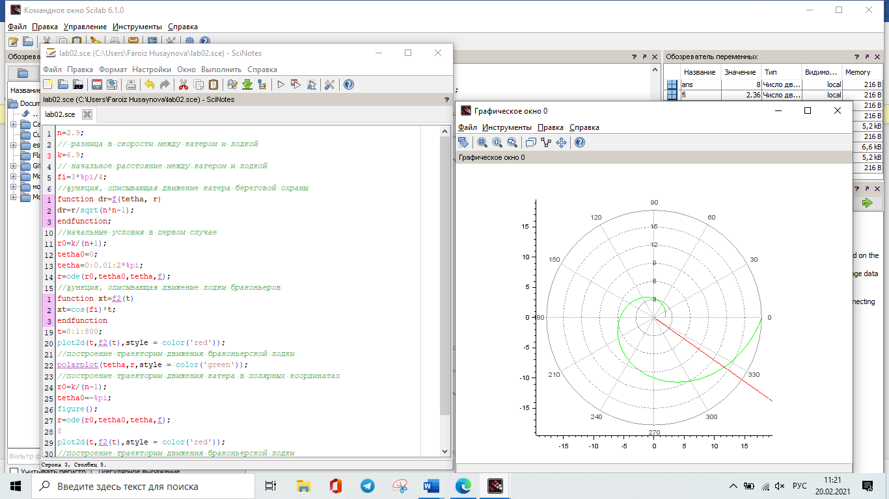
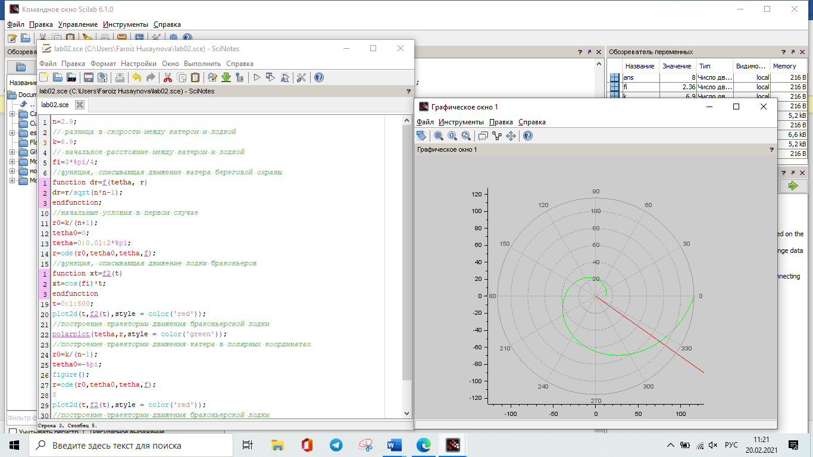

Предмет: Математическое моделирование
-------------------------------------

### 

### Выполнила: Хусайнова Фароиз Дилшодовна, НКНбд-01-18

Преподаватель: Кулябов Дмитрий Сергеев
--------------------------------------

Задача о погоне - вариант 11

**Содержание** {#содержание .TOC-Heading}
==============

[1 Цель работы 1](#цель-работы)

[2 Задание 1](#задание)

[3 Выполнение лабораторной работы 1](#выполнение-лабораторной-работы)

[4 Выводы 5](#выводы)

1 Цель работы
=============

Ознакомиться с задачей о погоне и решить одну из них.

2 Задание
=========

1.  Записать уравнение, описывающее движение катера, с начальными
    условиями двух случаев (в зависимости от расположения катера
    относительно лодки в начальный момент времени).
2.  Построить траекторию движения катера и лодки для двух случаев.
3.  Найти точку пересечения траектории катера и лодки

3 Выполнение лабораторной работы
================================

1.  Принимает за $t_{0}$ = 0 , $x_{Л}$ = 0 - место нахождения лодки
    браконьеров в момент обнаружения, $x_{К}$ =6.9 - место нахождения
    катера береговой охраны относительно лодки браконьеров в момент
    обнаружения лодки.

2.  Введем полярные координаты. Считаем, что полюс - это точка
    обнаружения лодки браконьеров $x_{0} = 0(\theta = x_{0} = 0)$, а
    полярная ось r проходит через точку нахождения катера береговой
    охраны.

3.  И катер и лодка должны быть на одном расстоянии от полюса theta, так
    их траектории пересекутся. Поэтому сначала катер двигается
    прямолинейно, пока не окажется на том же расстоянии от полюса, что и
    лодка браконьеров. После этого катер должен двигаться вокруг полюса
    удаляясь от него с той же скоростью, что и лодко браконьеров.

4.  Чтобы найти расстояние $x$ первого этапа движения, составим
    уравнения: Пусть $\frac{x}{\upsilon} = \frac{x + k}{\upsilon}$ - в
    первом случае, $\frac{x}{\upsilon} = \frac{x - k}{\upsilon}$ во
    втором случае.

Отсюда мы найдем два значения $x_{1}$ и $x_{2}$, задачу будем решать для
двух случаев.

$x_{1} = \frac{k}{3.9}$ ,при $\theta = 0$

$x_{2} = \frac{k}{1.9}$ ,при $\theta = - \pi$

5.  После того, как катер береговой охраны окажется на одном расстоянии
    от полюса, что и лодка, он должен сменить прямолинейную траекторию и
    начать двигаться вокруг полюса удаляясь от него со скоростью лодки
    $\upsilon$. Для этого раскладываем скорость катера на две
    составляющие vr - радиальная скорость. И vt - тангенциальная
    скорость.

-   Радиальная скорость - это скорость, с которой катер удаляется от
    полюса, vr = dr/dt. Нужно, чтобы эта скорость была равна скорости
    лодки, поэтому приравняем её к v: dr/dt = v.
-   Тангенциальная скорость - это линейная скорость вращения катера
    относительно полюса. Она равна произведению угловой скорости
    $\frac{\text{dθ}}{\text{dt}}$ на радиус r.
    $\upsilon_{t} = r\frac{\text{dθ}}{\text{dt}}$.
    $\upsilon_{t} = \sqrt{8.41v^{2} - v^{2}} = \sqrt{7.41}\upsilon$.
    $\ r\frac{\text{dθ}}{\text{dt}} = \sqrt{7.41}\upsilon$

Система уравнений: $\text{\ \ }\left\{ \begin{matrix}
\frac{\text{dr}}{\text{dt}} = \upsilon \\
r\frac{\text{dθ}}{\text{dt}} = \sqrt{7.41}\upsilon \\
\end{matrix} \right.\ \text{\ \ }$

с начальными условиями$\text{\ \ }\left\{ \begin{matrix}
\theta_{0} = 0 \\
r_{0} = \frac{6.9}{3.9} \\
\end{matrix} \right.\ \ $

$$\left\{ \begin{matrix}
\theta_{0} = - \pi \\
r_{0} = \frac{6.9}{1.9} \\
\end{matrix} \right.\ \ $$

Исключая из полученной системы производную по t, получаем уравнение:
$\frac{\text{dr}}{\text{dθ}} = \frac{r}{\sqrt{7.41}}$

Теперь, когда нам известно все, что нам нужно, построим траекторию
движения катера и лодки для двух случаев.

Запускаем для первого случая. На рисунке показано движение лодки в
полярных координатах при первом случае(Figure 1)

Figure 1:

Точка пересечения красного и зеленого графиков - точка пересечения
катера и лодки, исходя из графика, имеет параметры

$$\left\{ \begin{matrix}
\theta = 325 \\
r = 10.2 \\
\end{matrix} \right.\ \ $$

Запускаем для второго случая. На рисунке показано движение лодки в
полярных координатах при втором случае(Figure 2)

Figure 2:

Точка пересечения красного и зеленого графиков - точка пересечения
катера и лодки, исходя из графика, имеет параметры

$$\left\{ \begin{matrix}
\theta = 325 \\
r = 32.5 \\
\end{matrix} \right.\ \ $$

Наблюдаем, что при погоне «по часовой стрелке» для достижения цели
потребуется пройти значительно меньшее расстояние.

4 Выводы
========

Узнала, как можно смоделировать задачу о погоне, и решил одну из них.
